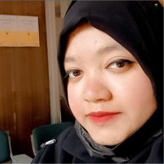

<h1 align="center">Hi there 👋, I'm Rayhana Akter Sumaya</h1>
<h3 align="center">🌼 CSE Student | 💻 Frontend Explorer | 🚀 Future Full Stack Developer</h3>

Learning in public. Building one phase at a time.

  

  

---

## 🧩 About Me

Hello! I’m a Computer Science student passionate about building clean, accessible, and responsive websites. I’m following a structured **16-month Full Stack Developer roadmap**, documenting my learning in **Obsidian**, and maintaining consistency through **daily LinkedIn updates**.

- 🎯 Currently in Phase 1: Core Web Foundations
- ✨ Focused on semantic HTML, modular CSS, and GitHub best practices
- 🧠 Believer in learning in public and writing meaningful commits
- 🤝 Open to collaboration, feedback, and tech conversations

---

## 🎯 Current Focus

> **Phase:** Core Web Foundations
> **Timeline:** May – June 2025

- HTML5 Semantic Layouts & Forms
- CSS3 Styling & Specificity
- JavaScript Basics
- Git & GitHub Workflow

---

## 🧭 Roadmap Snapshot

| Phase                     | Topics Covered              | Timeline            |
| ------------------------- | --------------------------- | ------------------- |
| 📌 Core Web Foundations   | HTML5, CSS3, JS Basics, Git | May – June 2025     |
| 🔄 Advanced JS + React    | ES6+, DOM, React, Hooks     | July 2025           |
| 🔧 PHP + Laravel          | MVC, Blade, APIs            | Aug – Sept 2025     |
| 🔗 Full Stack Integration | React + Laravel             | Oct – Nov 2025      |
| 🗄️ DB + Deployment        | MySQL, Hosting, CI/CD       | Dec 2025 – Jan 2026 |
| 💼 Job Readiness          | Projects, Resume, Job Hunt  | Feb – Apr 2026      |

---

## 💻 Featured Projects

> Projects built during each phase to reinforce practical learning.

| Project                | Description                                      | Status         | Code Link | Live Demo |
| ---------------------- | ------------------------------------------------ | -------------- | --------- | --------- |
| 💼 `semantic-layout`   | HTML5 portfolio using semantic tags & flex/grid  | ✅ Completed   | [Code](#) | [Live](#) |
| 🎨 `css-styling-lab`   | Styling exercises with box model, layout, colors | 🛠 In Progress  | [Code](#) | [Live](#) |
| 🔭 `js-selectors-demo` | DOM manipulation using querySelector & events    | 🔜 Coming Soon | [Code](#) | [Live](#) |

---

  
  
  
  
  
  
  
  
  
  
  
  

---

## 📈 GitHub Activity

  
  

---

## 🌐 Connect With Me

  
  

---

## 📝 Signature Quote

> _"The expert in anything was once a beginner."_ — Helen Hayes

---

_Thanks for stopping by! Let’s connect, collaborate, and grow together. 🚀_

➡️ **Feel free to explore my repositories and follow my journey!**